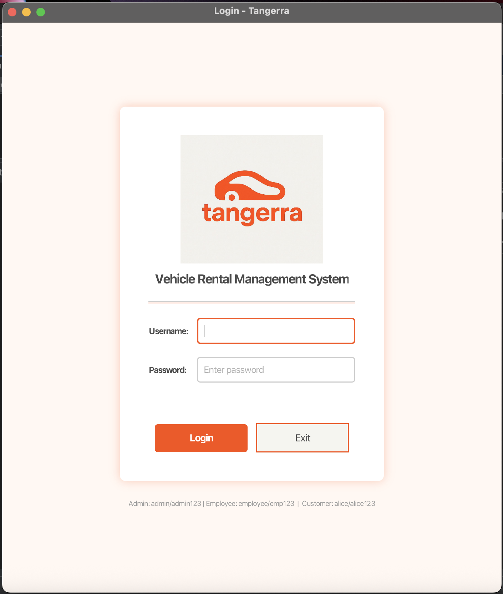
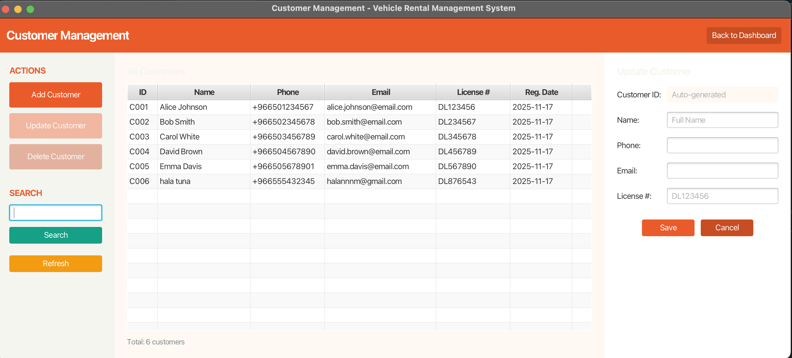
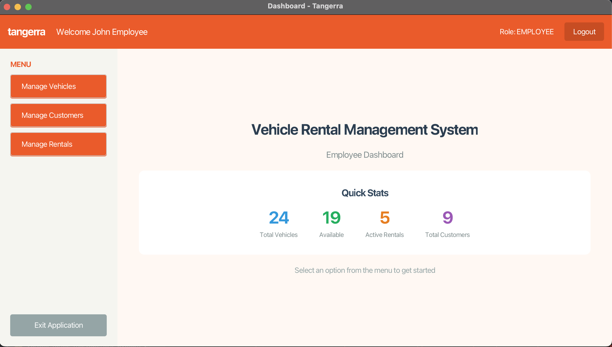
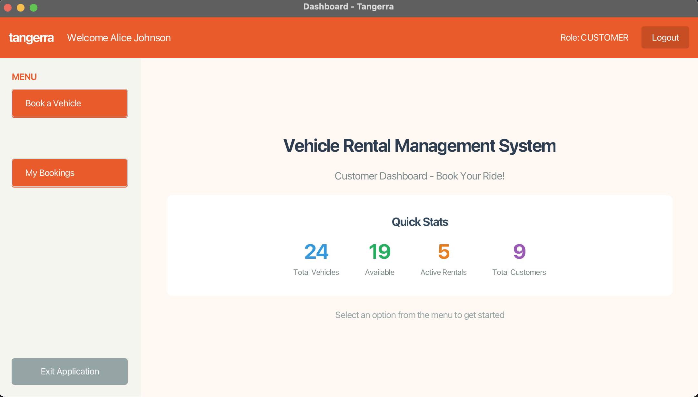
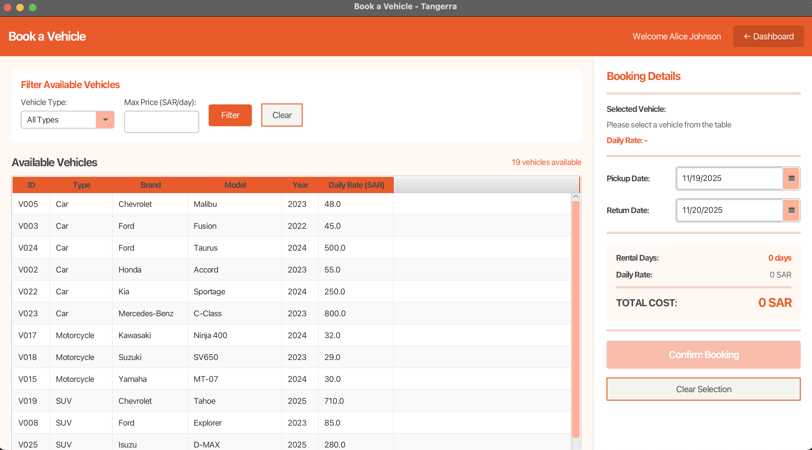

# Vehicle Rental Management System

A desktop vehicle rental management application built with **Java** and **JavaFX**, developed as a project for CS313 (Advanced Programming Language).

## Project Description

This system is an application with a central login page that authenticates users based on their credentials. It supports three key user roles, each with a role-based interface:

- **Admin** — Full system access, including user management, in addition to all employee functions.
- **Employee** — Manages vehicles, customers, and rentals, including processing vehicle returns and calculating costs.
- **Customer** — Browses available vehicles, creates bookings, views rental history, and checks booking details.

The system is designed to facilitate the complete vehicle rental workflow, from customer registration and vehicle booking through to returns and cost calculation.

## Features

- Role-based authentication and dashboards (Admin / Employee / Customer)
- Vehicle management (add, update, view availability)
- Customer management
- Rental booking, tracking, and returns processing
- Automatic cost calculation
- MySQL-backed persistence layer

## Screenshots

**Login**



**Admin — Vehicle Management**


**Admin — Customer Management**



**Employee Dashboard**



**Customer Dashboard**



**Customer — Book a Vehicle**



## Tech Stack

- **Language:** Java
- **UI:** JavaFX (FXML views + CSS styling)
- **Database:** MySQL
- **Build tool:** Ant (NetBeans project)
- **IDE:** Apache NetBeans

## Project Structure

```
Vehicle_rental_management_system_Project/
├── build.xml                  # Ant build script
├── manifest.mf
├── database/
│   └── schema.sql             # Database schema
├── nbproject/                 # NetBeans project metadata
└── src/
    └── vehicle_rental_management_system_p/
        ├── *.java             # Controllers, models, database access classes
        ├── resources/         # Images, CSS
        └── view/              # FXML view files
```

## Getting Started

### Prerequisites

- JDK 8 or later (with JavaFX, if not bundled with your JDK)
- MySQL Server
- Apache NetBeans (recommended) or Ant

### Setup

1. Clone the repository:
   ```bash
   git clone <your-repo-url>
   ```
2. Create the database using the provided schema:
   ```bash
   mysql -u <user> -p < database/schema.sql
   ```
3. Update the database connection details in `DatabaseConnection.java` to match your local MySQL setup.
4. Open the project in NetBeans, or build with Ant:
   ```bash
   ant build
   ant run
   ```

## Team

Rahaf Yahaya Al-Malki, Aryam Hadi Al-Faifi, Hala Abdullatif Al-Ghamdi, Raseel Mohammed Al-Shahrani, Noura Abdulaziz Al-Jalham

## Course

CS313 — Advanced Programming Language
